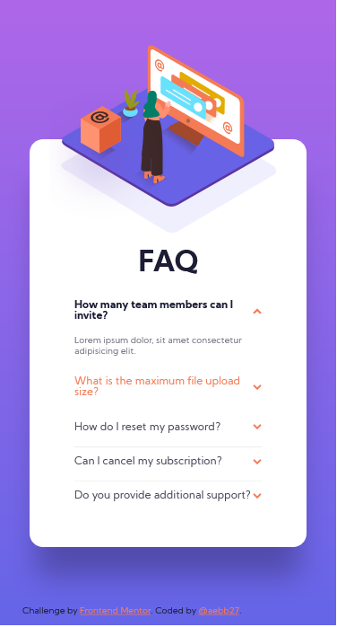
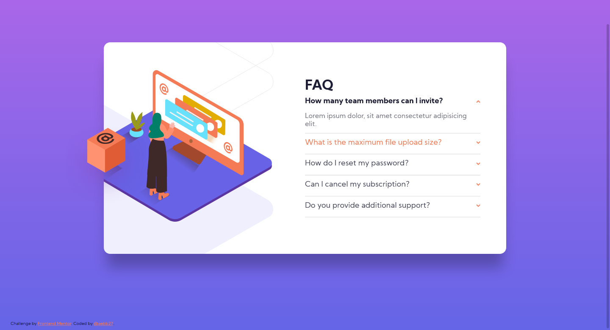

# Frontend Mentor - FAQ accordion card solution

This is a solution to the [FAQ accordion card challenge on Frontend Mentor](https://www.frontendmentor.io/challenges/faq-accordion-card-XlyjD0Oam). Frontend Mentor challenges help you improve your coding skills by building realistic projects. 

## Table of contents

- [Overview](#overview)
  - [The challenge](#the-challenge)
  - [Screenshot](#screenshot)
  - [Links](#links)
- [My process](#my-process)
  - [Built with](#built-with)
  - [Continued development](#continued-development)
  - [Useful resources](#useful-resources)
- [Author](#author)

## Overview

### The challenge

Users should be able to:

- View the optimal layout for the component depending on their device's screen size
- See hover states for all interactive elements on the page
- Hide/Show the answer to a question when the question is clicked

### Screenshot

### Links

- Solution URL: [Add solution URL here](https://your-solution-url.com)
- Live Site URL: [Add live site URL here](https://your-live-site-url.com)

## My process

### Built with

- Semantic HTML5 markup
- CSS custom properties
- CSS Grid
- Mobile-first workflow

### Continued development

Completing this challenge makes me realizes that I need to learn more about positioning images. Also, I have to look further at how to make font sizes responsive.
Additionally, read more documentation about CSS Naming Conventions to organized CSS Classes and achieving reusable styles through the interface.

### Useful resources

- [freeCodeCamp Build 15 JavaScript Projects](https://youtu.be/3PHXvlpOkf4?t=6511) - This helped me to understand how to close a previous question when the next one is open. I really liked this pattern and will use it going forward.

## Author

- Frontend Mentor - [@aebb27](https://www.frontendmentor.io/profile/aebb27)
- Twitter - [@aebb27](https://twitter.com/aebb27)
